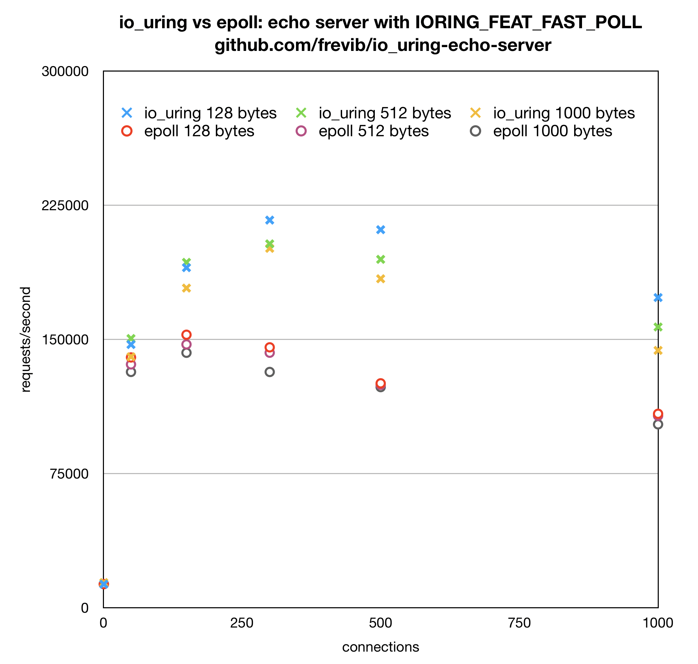

# io_uring echo server benchmarks

## requirements to run the benchmarks
* __Linux 5.6 or higher with IORING_FEAT_FAST_POLL required__ (available in https://git.kernel.dk/cgit/linux-block/?h=io_uring-task-poll). [here][kernel_compile] is how to compile a Linux kernel. Tip: clone Linux kernel from Github (much faster), then merge the io_uring-task-poll branch.

## programs under test
* echo server using an event loop created with __io_uring__ : https://github.com/frevib/io_uring-echo-server/tree/io-uring-feat-fast-poll
* echo server using an event loop created with __epoll__ : https://github.com/frevib/epoll-echo-server

## system specs for the benchmarks
* Macbook pro 6-core, 32GB RAM, 2,6 GHz
* Vmware Ubuntu 18.04, 8GB RAM, 6 vcores (3 physical cores)
* Linux ubuntu 5.6.0-rc1+ x86_64 with IORING_FEAT_FAST_POLL
* 2 vcores (one physical) isolated for the echo server with `isolcpus=0,1`.
* Echo server is assigned a dedicated CPU with `taskset -cp 0 [pid]`


## benchmark tool
* Rust echo bench: https://github.com/haraldh/rust_echo_bench
* `cargo run --release -- --address "localhost:6666" --number [number of clients] --duration [duration in secs] --length [msg size]`
* 2 runs for each combination of 128, 512 and 1000 bytes message size with 1, 50, 150, 300, 500 and 1000 clients


## benchmark results, requests/second

**io_uring with IORING_FEAT_FAST_POLL**

| clients    | 1     | 50     | 150    | 300    | 500    | 1000   | 
|:----------:|:-----:|:------:|:------:|:------:|:------:|:------:|
| 128 bytes  | 13093 | 147078 | 190054 | 216637 | 211280 | 173343 |
| 512 bytes  | 13140 | 150444 | 193019 | 203360 | 194701 | 156880 |
| 1000 bytes | 14024 | 140248 | 178638 | 200853 | 183845 | 143810 |


**epoll**

|  clients       | 1     | 50     | 150    | 300    | 500    | 1000   |
|:--------------:|:-----:|:------:|:------:|:------:|:------:|:------:|
|  128 bytes     | 13177 | 139863 | 152561 | 145517 | 125402 | 108380 |
|  512 bytes     | 13190 | 135973 | 147153 | 142518 | 124584 | 107257 |
|  1000 bytes    | 13172 | 131773 | 142481 | 131748 | 123287 | 102474 |


**scatter plot for the tables above**




## extra info
* Testing with many more, > 2000 clients, causes both echo servers to crash.
* When running many clients for a period of time, `io_uring_echo_server` becomes unresponsive in an uninterruptible sleep state. So for this echo server first the 128 bytes and 512 bytes benchmark is run sequentially, then the echo server is restarted and the 1000 bytes benchmark is run. I'm not sure what is happening here. There are no problems with the epoll echo server.
* io_uring_echo_server needs a separate buffer per connection. Each buffer is indexed by it's file descriptor number, like `bufs[fd_number]`. So if you have many connections you could have a segfault when the fd_number is too high. There is a fix for that in progress: https://lore.kernel.org/io-uring/20200228203053.25023-1-axboe@kernel.dk/T/#u
* the following script is used to run the benchmarks from the Rust echo bench directory:


```bash
#!/bin/bash
echo $(uname -a)

if [ "$#" -ne 1 ]; then
    echo "Please give port where echo server is running: $0 [port]"
    exit
fi

PID=$(lsof -itcp:$1 | sed -n -e 2p | awk '{print $2}')
taskset -cp 0 $PID

for bytes in 1 128 512 1000
do
	for connections in 1 50 150 300 500 1000
	do
   	cargo run --release -- --address "localhost:$1" --number $connections --duration 60 --length $bytes
   	sleep 4
	done
done

```


[kernel_compile]: https://www.cyberciti.biz/tips/compiling-linux-kernel-26.html
[benchmark_plot]: io_uring_vs_epoll.png =250x